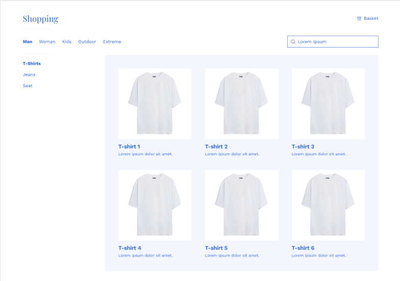
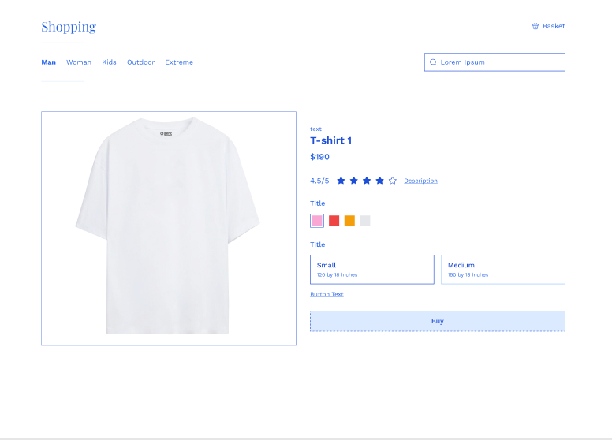

## Getting Started

This project was sent by the crewin company for an internship interview. 

They asked me to code the figma design. Below are the figma images.

I coded this project using nextjs, tailwind css and ant design.

